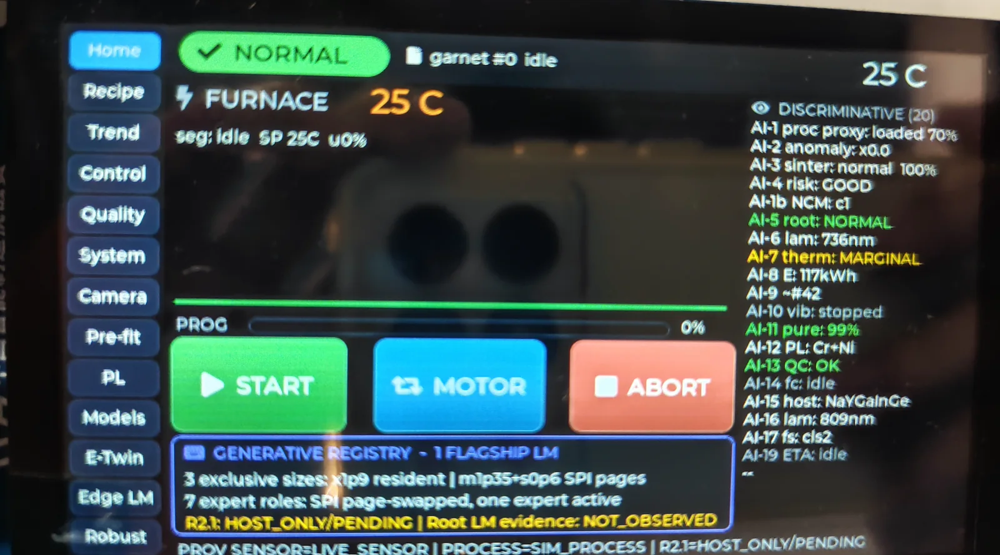
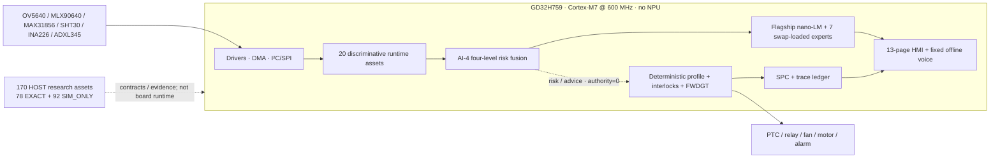
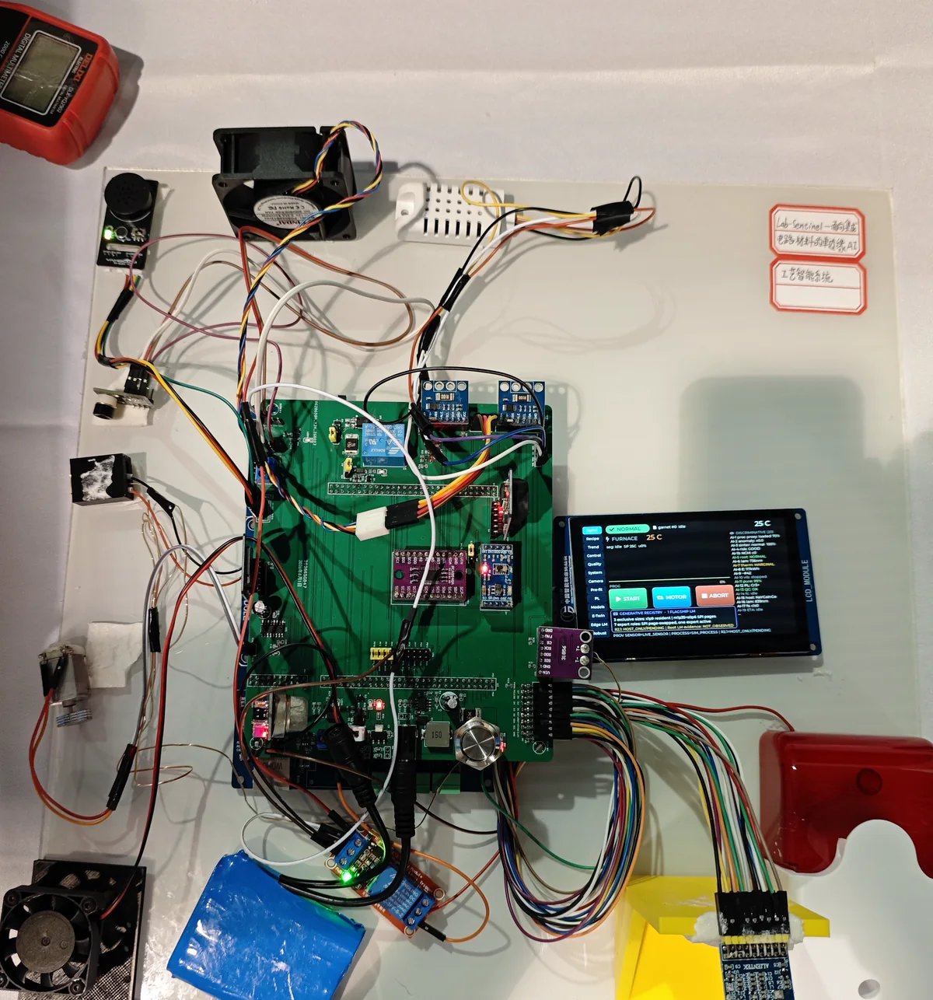

<div align="center">


# Lab-Sentinel

### 面向集成电路材料的 GD32H759 单芯片边缘 AI 工艺智能系统

**2026 CIMC“西门子杯”中国智能制造挑战赛 · 工业硬件研发方向 · 题目二**  
**全国初赛特等奖 · 全国决赛国家二等奖**

[](#比赛与奖项)
[](#比赛与奖项)
[](#比赛与奖项)
[](#系统架构)
[](#系统架构)
[](#三本事实账)
[](#安全与真实性边界)

[English](README_EN.md) · [系统文档](docs/README.md) · [复现指南](docs/06-reproduction/environment.md) · [演示视频](docs/08-demo/video-chapters.md) · [安全边界](docs/07-safety/truth-boundaries.md)

</div>

> **一句话：** 在无 NPU 的 GD32H759 上，把多模态感知、端侧 nano-LM、确定性安全控制和可追溯材料工艺证据闭合到一颗 MCU。

Lab-Sentinel 是一套面向集成电路材料研发的单芯片边缘 AI 工艺智能系统，以近红外荧光粉烧结作为真实验证载体。系统在 GD32H759（Cortex-M7 @ 600 MHz）上融合多模态感知、30 个板端运行资产 / 28 个逻辑模型、端侧 nano-LM、确定性控制、SPC 与可追溯证据；并以 ICMat-Forge、SinterGraph 和 VeriProcess 将同一套“数据合同—模型—证据—拒答—回退”方法拓展到半导体材料筛选、制程量测、SEM 缺陷和先进封装任务。

项目采用三本事实账：每一个数字都绑定执行位置、数据来源和证据等级，失败门禁也作为工程结果保留。

## 三本事实账


| 账本 | 数量 | 状态 | 可以怎样表述 |
|---|---:|---|---|
| **BOARD** | 30 个运行资产 / 28 个逻辑模型 | GD32H759 冻结链真板执行 | 可报告板端 DWT 时延、golden 自检和现场演示 |
| **HOST–EXACT** | 78（P25 / G25 / S28） | 精确 source / label / split 绑定并通过 HOST 合同 | 可报告 HOST 算法指标；**不得写成已经上板** |
| **HOST–SIM_ONLY** | 92（P87 / G5 / S0） | 仿真与接口研究资产 | 只用于调度、拒答和工程扩展研究；**不得冒充实验或产线效果** |

170 个 HOST 资产合计为 P112 / G30 / S28，全部 `authority=0`。它们完成了分层 HOST 验收和 microSD **文件级介质预置**；真板 catalog 正文持续读取发生 CRC 门禁拒绝，entry / payload 未加载，新增板端执行数为 **0**。因此“30 BOARD + 170 HOST = 200”只是一套分层研发资产总账，不是 200 个板上模型。

对应机器可读证据：[`release_gap_audit.v7.json`](evidence/public/release_gap_audit.v7.json)、[`host_closure.v7.json`](evidence/public/host_closure.v7.json) 与[统一真板回执](evidence/public/forge200_correct32gb_sharedbus_hardware_retest_20260806_141457_receipt.v9.json)。

## 90 秒看懂项目

| 层次 | 做了什么 | 为什么重要 |
|---|---|---|
| **真实材料锚点** | 281 条历史实测 Fluoromax PL 光谱、52 张真实坩埚照片、67 条材料记录（其中 37 条记录具可用 XRD 相标签） | 先在可追溯的材料与过程上验证方法，不把公开计算或教师输出冒充实验真值 |
| **国产 MCU 边缘核心** | GD32H759、无 NPU、离线推理、自制一体化扩展 PCB、13 页 HMI、CI1302 固定离线语音 | 断网可用、低时延、数据不出域，并展示资源受限部署的真实工程取舍 |
| **确定性安全链** | 工艺 profile、互锁、看门狗、受控触摸/语音入口、人工监督掌握执行权 | AI 只做预测、诊断、解释和建议，错误结论不能越过安全边界 |
| **IC 材料方法拓展** | 材料筛选、制程虚拟量测、SEM 缺陷分析、先进封装任务地图 | 迁移的是过程—结构—性能和证据治理方法，不是把荧光粉等同于整个集成电路产业 |

## 演示

<p align="center">
  <a href="docs/08-demo/video-chapters.md"></a>
</p>

- [五分钟演示的分章、观察点、源码入口和真实性边界](docs/08-demo/video-chapters.md)
- [原型机 30 秒绕机导览](docs/08-demo/prototype-tour.md)
- [GitHub Release：经过清理的视频章节与完整技术证据包](https://github.com/Xiaomiju-x/Lab-Sentinel-CIMC2026/releases/tag/v1.0.1)

原始手机视频不进入 Git 历史：公开章节已经重新编码并移除 GPS、设备型号和拍摄系统元数据。

## 为什么做

材料研发中的困难往往不在“缺一个模型名字”，而在于数据少且贵、工艺窗口窄、量测滞后、批次漂移、结论难复核。云端方案还会引入断网、延迟、数据出域和控制权边界问题。

Lab-Sentinel 的目标是把材料 AI 从“给一个答案”推进为：

1. **给出来源**：数据卡、来源许可、family/group split 与防泄漏门禁；
2. **给出边界**：BOARD、HOST–EXACT、HOST–SIM_ONLY 分账；
3. **给出证据**：baseline、三种子、量化 parity、golden、ABI、哈希与回执；
4. **会拒答**：来源不足、资源不符或介质异常时 fail-closed；
5. **能回退**：模型 `authority=0`，确定性控制与人工保留最终执行权。

## 系统架构



完整数据流、FreeRTOS 任务和内存预算见 [`docs/01-architecture/`](docs/01-architecture/)。

## 可核验结果

| 证据锚点 | 结果 | 适用边界 |
|---|---:|---|
| AI-12 PL 材料判别 | 281 条历史实测光谱，5-fold OOF Accuracy **98.22%**，Macro-F1 **97.37%** | 板端 UI 回放其中 3 条代表谱；不是现场在线光谱仪 |
| AI-12 量化 | FP32 **0.488 ms** → INT8 **0.153 ms**，约 **3.2×**，冻结样本判决一致 | GD32H759 DWT 真板计时；不是编译器估算 |
| 最重板端资产 AI-3 | 近期真板约 **67.81 ms** | 只用于该冻结模型与当前测试口径 |
| P096 SEM 缺陷分割 | W8，mIoU **0.7794**、Boundary-F1 **0.9153**、小缺陷召回 **0.8913** | 公开 Carinthia · HOST–EXACT · 非 GD32 / 非产线指标 |
| VeriProcess | **69 / 69** HOST 用例通过 | HOST 证据链用例，不等于 69 个模型或产线认证 |
| ModelBank HOST | 1,000 次 A/B 干跑与故障矩阵 | HOST 工程验收；microSD 预置不等于板端执行 |

更完整且带测法的结果见[基准说明](docs/06-reproduction/benchmarks.md)。

## 硬件

<p align="center">
  
  
</p>

- **主控：** GD32H759IMK6，Cortex-M7 @ 600 MHz，无 NPU；
- **集成：** 自制一体化扩展 PCB，替代早期杜邦线搭建；
- **热工：** K 型热电偶 + MAX31856 点温、MLX90640 32×24 面热场、SHT30 环境温湿度；
- **设备健康：** ADXL345 振动、两路 INA226 电气观测设计、风扇转速边沿；
- **视觉与环境：** OV5640 320×240 RGB565 运行合同、MQ-135 仅作气体/烟雾趋势；
- **交互：** 800×480 LCD + GT911，13 页本地 HMI；CI1302 定义 17 条固定离线命令和 8 字节校验协议；
- **执行：** 低压 PTC、双风扇、H 桥电机和外接报警单元，由确定性链路调度。

相机初始化表的早期实现来源许可无法确认，因此本仓库只保留公开接口与集成说明，不重新分发该表；中文字体也改用 OFL 字体构建流程，不发布 Windows SimHei 派生字形。详见[硬件文档](docs/02-hardware/hardware-overview.md)和[第三方声明](THIRD_PARTY_NOTICES.md)。

## 固件、HMI 与语音

冻结固件来自 R2.1 发布线；公开 Keil 工程的实际目标名为 `CIMC_GD32_Template`，使用 FreeRTOS、LVGL、DMA、DWT 与共享 SPI / I²C 多路复用。HMI 页面以真机源码为准：

`Home / Recipe / Trend / Control / Quality / System / Camera / Pre-flt / PL / Models / E-Twin / Edge LM / Robust`

CI1302 不是自由对话大模型。固件定义 17 条固定离线语义标签，串口帧校验失败不动作；触控和语音进入同一受控命令路径。详情见[13 页 HMI](docs/03-firmware/hmi-13-pages.md)与[17 条语音命令](docs/03-firmware/voice-17-commands.md)。

## AI 与集成电路材料拓展

### 冻结板端链

- 20 个判别式运行资产：坩埚视觉、PL、风险融合、鲁棒性、设备健康等；
- 旗舰 nano-LM 的三个部署档位只算 **1 个逻辑模型**；
- 7 个领域专家按需换载；
- golden 自检、DWT 计时、量化一致性和资源门禁随源码公开。

### ICMat-Forge / SinterGraph / VeriProcess

- **ICMat-Forge**：把候选任务变成具有来源、split、baseline、量化、golden、ABI 和版本的可审计资产；
- **SinterGraph**：组织过程—结构—性能关系与时间截止，避免把烧后 XRD / PL 信息泄漏给烧前预测。专用候选 CAND-P-042 因缺少记录级 L2 实验目标在预 GPU 数据门被拒绝，仓库保留方法与拒绝证据；
- **VeriProcess**：把来源、拒答、哈希、A/B ledger、WAL 和回退策略串成验证流程。

四类 IC 材料任务覆盖材料筛选、制程虚拟量测、SEM 缺陷分析和先进封装可靠性。CMP / PVD 主要停留在任务映射，封装预测多为 SIM_ONLY；没有晶圆厂或封装产线验证。详见[HOST 资产说明](docs/04-ai/icmat-forge-host.md)。

## 仓库结构

```text
firmware/                 GD32H759 固件、驱动、FreeRTOS、LVGL 与板端模型
hardware/design/          团队原创 PCB/CAD 与制造输出（CERN-OHL-S-2.0）
ai/contracts/             244 个预注册任务与 170 个分层资产合同
ai/pipeline/              训练、量化、打包、门禁和回执生成工具
ai/gd32-embedded-ai-tool/ AI-4 官方工具链路径与 host golden
data/provenance/          数据来源、许可、split 和防泄漏材料
evidence/public/          精简、机器可读、可公开的验收回执
docs/                     架构、硬件、固件、AI、复现、安全与比赛文档
assets/                   隐私清理后的图片、图表与视频封面
tools/                    公开发布校验、证据索引和开发工具
tests/                    无硬件也能运行的仓库与合同烟测
```

第一次阅读代码可直接进入[源码导览](docs/00-overview/code-tour.md)：它把启动入口、FreeRTOS/HMI、固定语音、传感与执行、板端模型自检、ModelBank、VeriProcess 和发布门禁逐项链接到真实文件。

## Quick Start

### A. 无硬件：验证公开发布包

```bash
python tools/verify_release.py --strict
python -m unittest discover -s tests -v
```

这会检查必要文档、三本账、证据 JSON、绝对路径、秘密模式、单文件大小和公开 manifest；不会伪装成真板测试。

### B. HOST 合同与证据核验

```bash
python tools/summarize_ledgers.py
python tools/verify_evidence.py
```

这一级核验账本、合同与公开回执，**不等同于重新推理或训练**。完整技术证据包位于 GitHub Release，而不是普通 Git 历史；下载、SHA-256 校验、目录结构与可复现边界见 [`docs/06-reproduction/host-smoke.md`](docs/06-reproduction/host-smoke.md)。281 条历史实测 PL 原始谱未授予无条件再分发许可，因此公开仓库可以复核 98.22% 结果的证据链和 3 条代表谱 golden，不能声称从公开原始数据完整重训该指标。

### C. GD32H759 固件

1. 使用 Keil MDK 打开 `firmware/keil_proj/project/CIMC_GD32_Template.uvprojx`；
2. 选择目标 `CIMC_GD32_Template`（R2.1 是归档发布线名称）；
3. 按 [`docs/03-firmware/build-keil-r21.md`](docs/03-firmware/build-keil-r21.md) 安装官方依赖并编译；
4. 使用既有 DAPLink / CMSIS-DAP 和用户自己的硬件烧录；
5. 依据 [`docs/06-reproduction/board-acceptance.md`](docs/06-reproduction/board-acceptance.md) 采集串口、DWT、golden 与资源证据。

本仓库不分发 Keil、GD32 Embedded AI Tool、厂商安装器、官方比赛模板或来源许可不明的相机初始化表。公开 Keil 工程的全部文件引用已经闭合，但为遵守再分发边界，默认使用**显式相机禁用适配器**与 ASCII 字体回退；它不是比赛现场完整二进制的逐字节重建。需要实时 OV5640 与中文字体时，请按目录说明接入经审核许可的实现并重新做真板验收。

## 安全与真实性边界

> [!CAUTION]
> 这是研究与竞赛原型，不是经过 IEC 61508、功能安全、EMC、计量或高温设备认证的产品。不得直接用于真实工业高温炉或安全关键控制。

- AI 始终 `authority=0`；确定性控制、互锁、看门狗、人工和受控命令分发保留执行权；
- 原型热过程是低温桌面台架；1500 ℃ 曲线是板端确定性工艺 profile 回放，不是真实高温炉实测；
- PL 页面是历史实测光谱回放，不是在线光谱仪；
- MQ-135 只报告趋势，不报告已标定 ppm；
- `ProofPass` 是篡改可发现的证据记录，不是数字签名、身份认证或安全认证；
- `HOST–EXACT` 不等于 BOARD，`SIM_ONLY` 不等于实验；
- 材料和模型结论必须回到各自 data card / model card 的适用域。

完整边界、失效模式与负责任使用指南见 [`docs/07-safety/`](docs/07-safety/)。安全漏洞请按 [`SECURITY.md`](SECURITY.md) 私下报告。

## 比赛与奖项

| 阶段 | 赛项 | 结果 |
|---|---|---|
| 全国初赛 | 2026 CIMC“西门子杯”工业硬件研发方向 · 题目二 | **特等奖** |
| 全国决赛 | 2026 CIMC“西门子杯”工业硬件研发方向 · 题目二 | **国家二等奖** |

奖项是项目历程的一部分，但开源价值不依赖名次：代码、合同、失败回执、复现脚本和安全边界才是本仓库的技术承诺。

<p align="center">
  
  
</p>

更多隐私清理后的现场照片见[比赛画廊](docs/09-competition/gallery.md)。

## 文档导航

| 主题 | 入口 |
|---|---|
| 项目故事与术语 | [`docs/00-overview/`](docs/00-overview/) |
| 系统架构与资源 | [`docs/01-architecture/`](docs/01-architecture/) |
| PCB、BOM、引脚与 bring-up | [`docs/02-hardware/`](docs/02-hardware/) |
| 固件构建、HMI 与语音 | [`docs/03-firmware/`](docs/03-firmware/) |
| 板端模型、nano-LM、量化与 ICMat-Forge | [`docs/04-ai/`](docs/04-ai/) |
| 数据卡、许可、split 与防泄漏 | [`docs/05-data/`](docs/05-data/) |
| 环境、HOST、真板验收与指标 | [`docs/06-reproduction/`](docs/06-reproduction/) |
| 安全链、真实性与失效模式 | [`docs/07-safety/`](docs/07-safety/) |
| Demo、视频分章与原型导览 | [`docs/08-demo/`](docs/08-demo/) |
| 比赛、奖项与画廊 | [`docs/09-competition/`](docs/09-competition/) |

## 贡献、引用与许可

- 贡献前请读 [`CONTRIBUTING.md`](CONTRIBUTING.md)；模型 PR 必须携带 task contract、data card、baseline、golden 和 `authority=0`。
- 学术引用信息在 [`CITATION.cff`](CITATION.cff)。
- 原创软件 Apache-2.0；原创硬件 CERN-OHL-S-2.0；原创文档与明确授权媒体 CC-BY-4.0。数据、模型、照片、字体、商标与第三方组件使用各自条款。
- 完整许可矩阵见 [`LICENSE`](LICENSE)、[`THIRD_PARTY_NOTICES.md`](THIRD_PARTY_NOTICES.md)、[`DATA_LICENSES.md`](DATA_LICENSES.md)、[`MODEL_LICENSES.md`](MODEL_LICENSES.md) 与 [`MEDIA_LICENSE.md`](MEDIA_LICENSE.md)。

如果这个项目对你的边缘 AI、材料信息学或嵌入式系统工作有帮助，欢迎 Star、Fork，并把新的可复现证据带回来。
