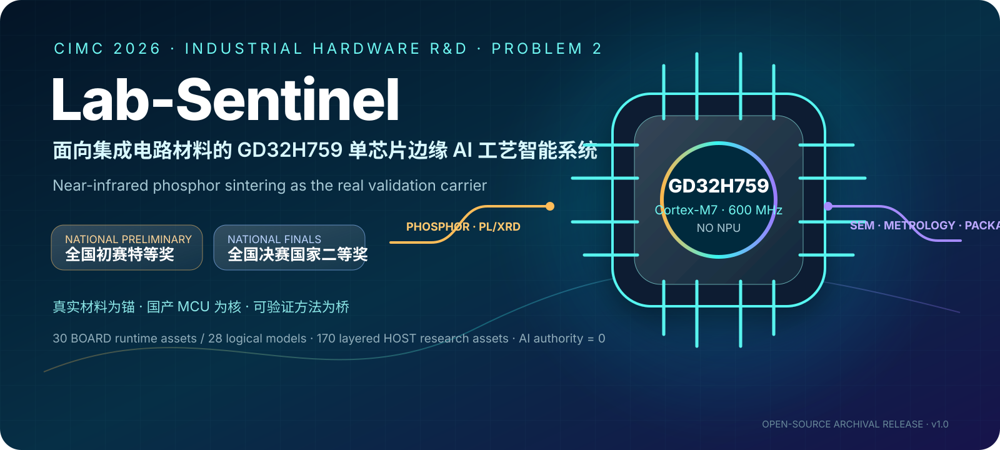
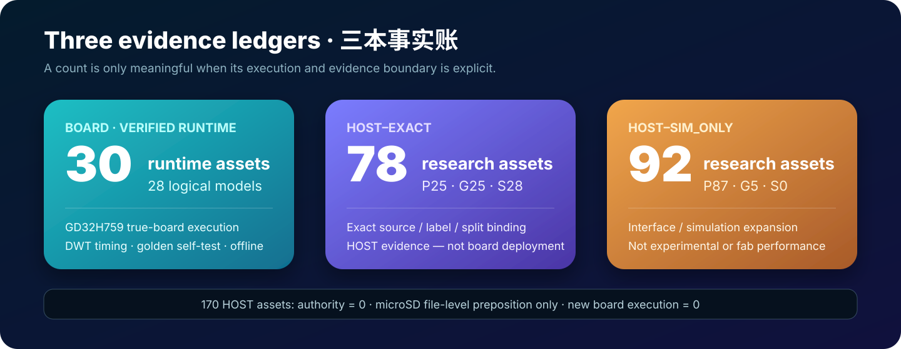
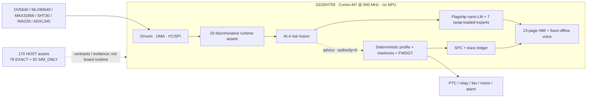
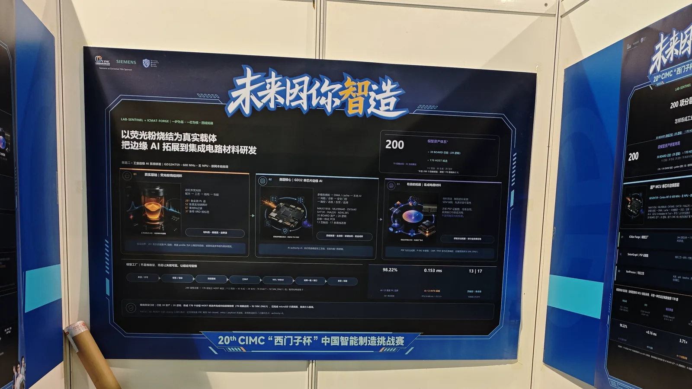
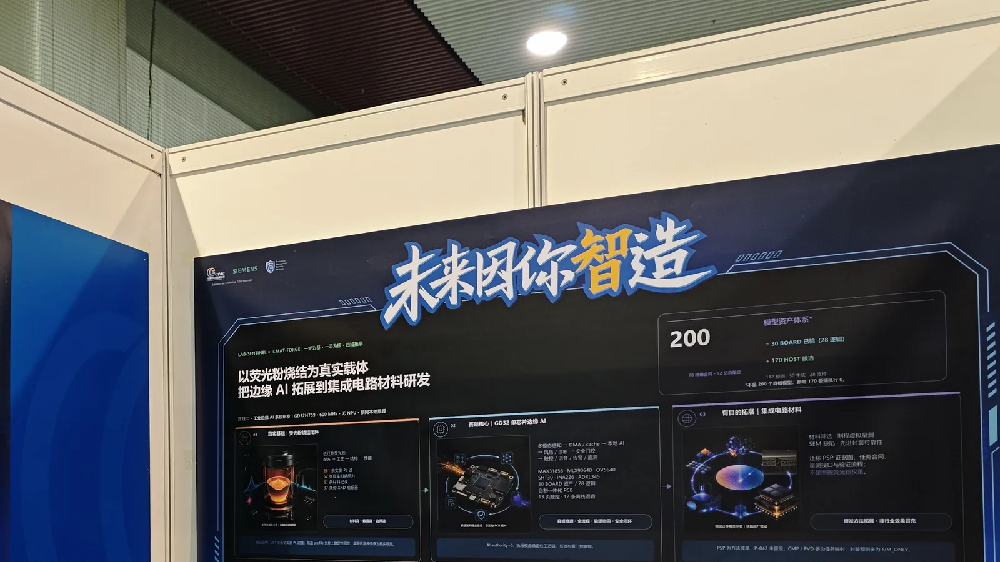
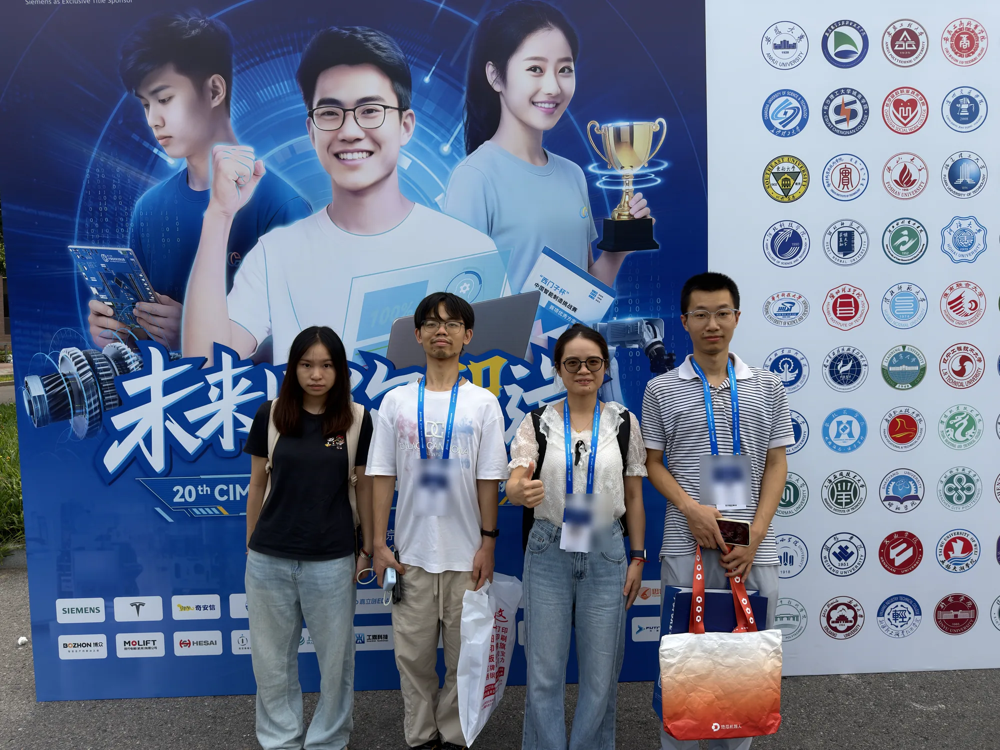

<div align="center">



# Lab-Sentinel

### Single-Chip Edge-AI Process Intelligence for Integrated-Circuit Materials on GD32H759

**2026 CIMC “Siemens Cup” China Intelligent Manufacturing Challenge**  
**Industrial Hardware R&D · Problem 2**  
**National Preliminary Special Prize · National Second Prize (National Finals)**

[中文](README.md) · [Documentation](docs/README.md) · [Reproduction](docs/06-reproduction/environment.md) · [Demo](docs/08-demo/video-chapters.md) · [Safety](docs/07-safety/truth-boundaries.md)

</div>

> On an NPU-free GD32H759, Lab-Sentinel closes multimodal sensing, on-device nano-LMs, deterministic safety control and traceable materials-process evidence on one MCU.

Lab-Sentinel is a single-chip edge-AI process-intelligence system for integrated-circuit materials R&D, using near-infrared phosphor sintering as its real validation carrier. On an NPU-free GD32H759 (Cortex-M7 @ 600 MHz), it integrates multimodal sensing, 30 board-runtime assets / 28 logical models, on-device nano-LMs, deterministic control, SPC and traceable evidence. ICMat-Forge, SinterGraph and VeriProcess then extend the same data-contract, model, evidence, refusal and rollback method to semiconductor-material screening, process metrology, SEM defects and advanced packaging.

## Three evidence ledgers



| Ledger | Count | Meaning |
|---|---:|---|
| **BOARD** | 30 runtime assets / 28 logical models | Executed on the frozen GD32H759 chain; board timing and golden evidence are valid |
| **HOST–EXACT** | 78 (P25 / G25 / S28) | Exact source/label/split binding with host acceptance; **not board deployment** |
| **HOST–SIM_ONLY** | 92 (P87 / G5 / S0) | Simulation/interface research only; **not experimental or fab performance** |

The 170 host assets total P112 / G30 / S28 and all have `authority=0`. They were prepositioned on microSD at the file-media level. A sustained catalog-body CRC failure triggered fail-closed behavior before entry/payload loading, so new board execution remained **zero**. “30 BOARD + 170 HOST = 200” is a layered R&D portfolio, never “200 models running on the board.”

## What is real

- **Materials carrier:** 281 historical measured Fluoromax PL spectra, 52 real crucible images, and 67 material records; 37 records have usable XRD phase labels. This is not “37 independent XRD spectra.”
- **Board:** GD32H759IMK6, Cortex-M7 at 600 MHz, no NPU, offline inference, a custom integration PCB, a 13-page HMI and fixed-vocabulary CI1302 voice input.
- **Safety:** every learned model has `authority=0`; deterministic control, interlocks, watchdogs and the operator retain actuation authority.
- **IC-material reach:** materials screening, virtual metrology, SEM defect analysis and advanced-packaging task maps. The method is transferred; phosphors are not equated with the entire IC-materials industry.

## Architecture



## Evidence highlights

| Anchor | Result | Boundary |
|---|---:|---|
| AI-12 PL classification | 281 measured historical spectra; 5-fold OOF Accuracy **98.22%**, Macro-F1 **97.37%** | Board UI replays 3 representative spectra; no online spectrometer |
| AI-12 quantization | FP32 **0.488 ms** → INT8 **0.153 ms**, about **3.2×**, identical frozen decisions | GD32H759 DWT timing, not compiler estimation |
| AI-3 | about **67.81 ms** in the latest board measurement | Only the frozen model and stated test contract |
| P096 SEM segmentation | W8; mIoU **0.7794**, Boundary-F1 **0.9153**, small-defect recall **0.8913** | Public Carinthia, HOST–EXACT, not GD32 or production-line performance |
| VeriProcess | **69 / 69** host cases | Host evidence-chain cases, not 69 models or safety certification |

## Reproduce without overclaiming

```bash
python tools/verify_release.py --strict
python -m unittest discover -s tests -v
python tools/summarize_ledgers.py
python tools/verify_evidence.py
```

For firmware, open `firmware/keil_proj/project/CIMC_GD32_Template.uvprojx` in Keil MDK, select the actual XML target `CIMC_GD32_Template` (R2.1 is the archived release-line name), and follow [`docs/03-firmware/build-keil-r21.md`](docs/03-firmware/build-keil-r21.md). The public target uses an explicit camera-disabled adapter and ASCII font fallback; supply reviewed licensed replacements for live OV5640 capture and CJK glyphs. Vendor tools, installers, competition templates and source code without established redistribution permission are intentionally not mirrored.

The reviewed model/evidence archive remains in the immutable [v1.0.1 Release](https://github.com/Xiaomiju-x/Lab-Sentinel-CIMC2026/releases/tag/v1.0.1). The [v1.0.2 media archive](https://github.com/Xiaomiju-x/Lab-Sentinel-CIMC2026/releases/tag/v1.0.2) adds the complete continuous 5:06 demonstration, the five independently seekable chapters and the privacy-clean team portrait. These default derivatives remove GPS, device and capture-system metadata and redact visible badge identifiers. At the maintainer's explicit archival direction, the Release also carries a clearly named `privacy-sensitive` ZIP containing the exact seven originally supplied media files; that archive may retain location/device metadata, identifiable people and badges, is kept out of Git history, and is not covered by the default media license.

The public HOST commands verify ledgers, contracts and receipts; they are not a claim of full retraining. The 281 historical measured PL spectra are not redistributed under an unrestricted public-data grant. The repository therefore supports evidence-chain verification and the three representative on-board golden spectra, not reproduction of the reported 98.22% metric from public raw spectra alone. Download and checksum instructions are in [`docs/06-reproduction/host-smoke.md`](docs/06-reproduction/host-smoke.md).

## Safety and truth boundary

> [!CAUTION]
> This is a research and competition prototype, not an IEC 61508, functional-safety, EMC, metrology or high-temperature-equipment certified product. Do not connect it directly to a real industrial furnace or safety-critical plant.

The desktop rig is a low-temperature bench. The 1500 °C curve is a deterministic on-board process-profile replay, not a real-furnace measurement. The PL page replays historical measured spectra. MQ-135 is trend-only. HOST–EXACT is not BOARD, and SIM_ONLY is not experimental evidence. See [`docs/07-safety/`](docs/07-safety/).

## Repository map

`firmware/` contains GD32 source and board-runtime models; `hardware/design/` contains original PCB/CAD; `ai/` contains contracts and reproducibility pipelines; `data/provenance/` contains source and license records; `evidence/public/` contains compact machine-readable receipts; `docs/` contains the full engineering narrative; `assets/` contains privacy-clean media. Start with the [code tour](docs/00-overview/code-tour.md) to move from each claim to its implementation.

## Competition and gallery

<p align="center">
  
  
</p>

<p align="center">
  
</p>

The awards are part of the project history. The repository's technical promise comes from source, contracts, failure receipts, reproducible checks and explicit boundaries—not from rank alone.

## License and contribution

Original software is Apache-2.0, original hardware design is CERN-OHL-S-2.0, and original documentation/explicitly marked media is CC-BY-4.0. Data, weights, photographs, fonts, trademarks and third-party components keep their own terms. Read [`LICENSE`](LICENSE), [`THIRD_PARTY_NOTICES.md`](THIRD_PARTY_NOTICES.md), [`DATA_LICENSES.md`](DATA_LICENSES.md), [`MODEL_LICENSES.md`](MODEL_LICENSES.md) and [`MEDIA_LICENSE.md`](MEDIA_LICENSE.md).

Contributions are welcome under [`CONTRIBUTING.md`](CONTRIBUTING.md). Please cite the software using [`CITATION.cff`](CITATION.cff).
