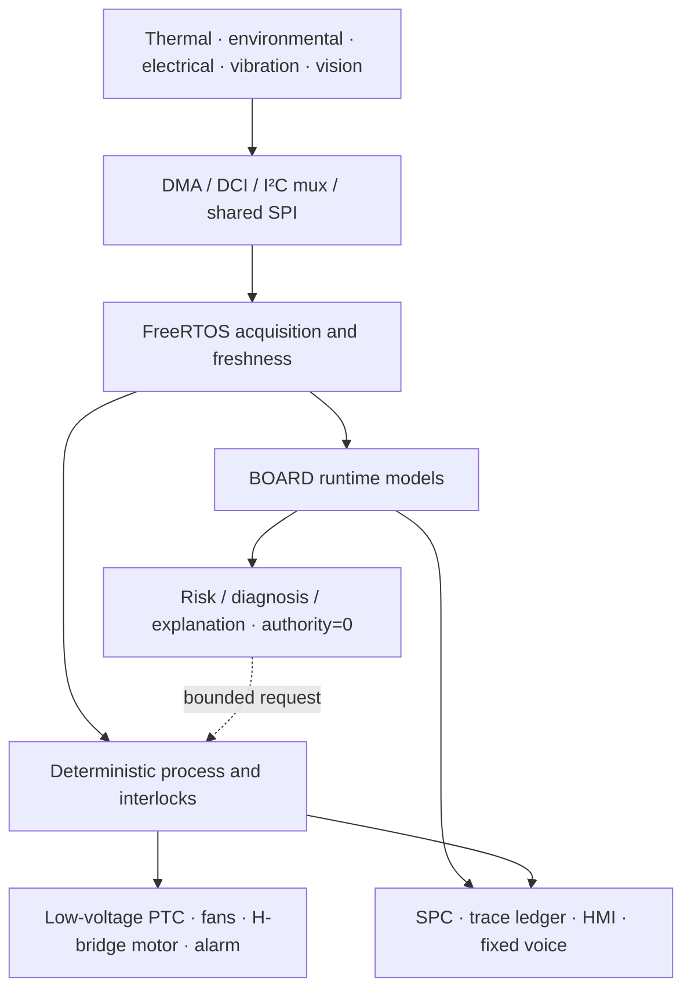

# System architecture

The architecture keeps observation, inference and actuation as separate trust
domains.

The PC/cloud side trains and performs heavy preprocessing. The MCU performs
deployment inference, local interaction and deterministic coordination. HOST
assets are linked by contracts/evidence only; they are not hidden remote calls.

The prototype is offline-capable. A PC may display serial logs during
development, but it is not a substitute inference backend.

