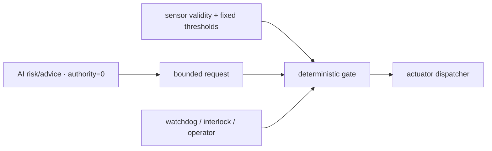

# Deterministic control and AI authority

The learned path produces bounded risk, diagnosis, explanation or a request.
It does not write a relay, MOSFET, fan, motor or alarm register directly.

Hard physical limits must be independent of inference. Severe AI results can be
debounced and request a safe state, but immediate physical over-limit behavior
belongs to the deterministic path. On missing/stale input, the model refuses or
degrades; it does not reuse a value as if fresh.

