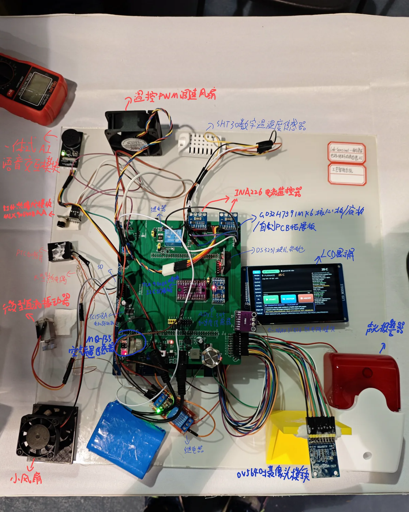

# Prototype tour

Thirty-second script:

> The central GD32H759 and custom PCB form the edge-control and AI hub. CI1302
> provides fixed offline voice, while the LCD and GT911 provide local touch.
> OV5640 supplies visible images. A K-type probe with MAX31856 observes point
> temperature, MLX90640 observes a 32×24 thermal field, and SHT30 adds ambient
> context. INA226 channels observe electrical response, ADXL345 observes the
> eccentric motor's vibration, and MQ-135 adds a gas-change trend. The
> low-voltage PTC, fans, H-bridge motor and alarm are dispatched by deterministic
> control. Every AI model has authority zero.

The annotated image is a cleaned public derivative. Where an old handwritten
module label conflicts with the firmware contract, use the generic functional
name (for example, “H-bridge motor driver”) until the physical marking is
verified.

