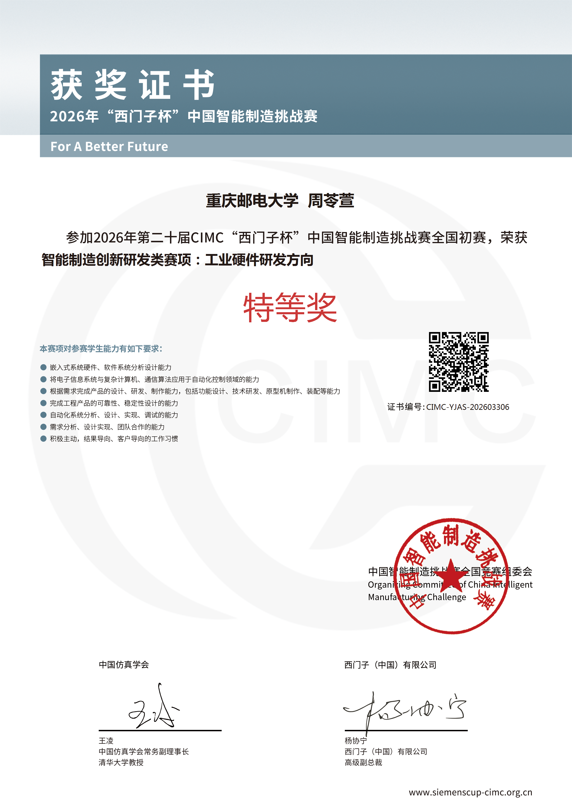
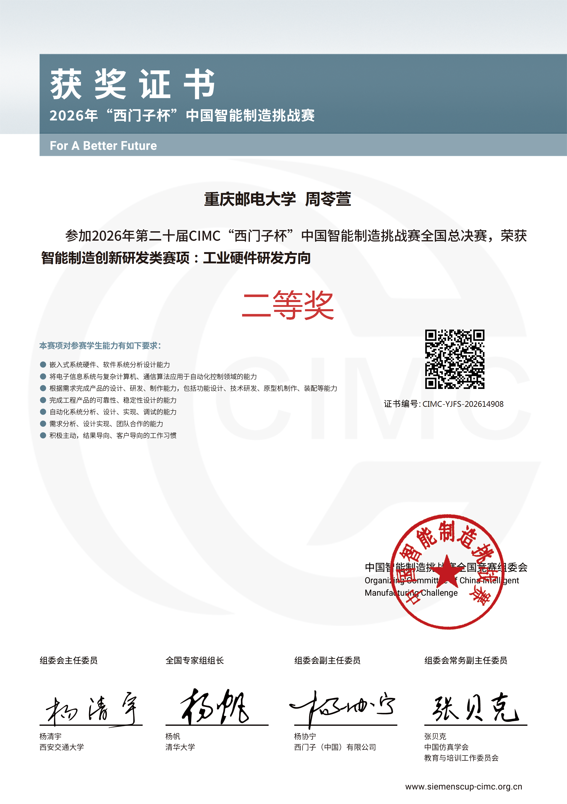

# Competition gallery

## Award certificates

The certificate identifiers and verification QR codes are intentionally
retained for public verification. The certificates may not be altered or used
for impersonation.

## Booth overview

## Poster wall

## Team at the national finals

## Prototype and HMI

Public derivatives are re-encoded without EXIF/GPS metadata. Visible badges,
barcodes and phone screens are redacted. The team portrait is published as an
archival project record at the maintainer's explicit direction; it does not
grant downstream advertising, biometric-analysis or model-training rights.
See `MEDIA_LICENSE.md`.
